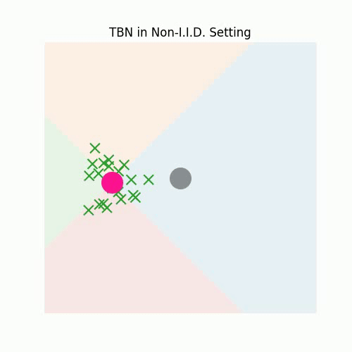
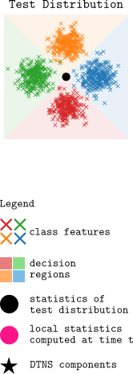
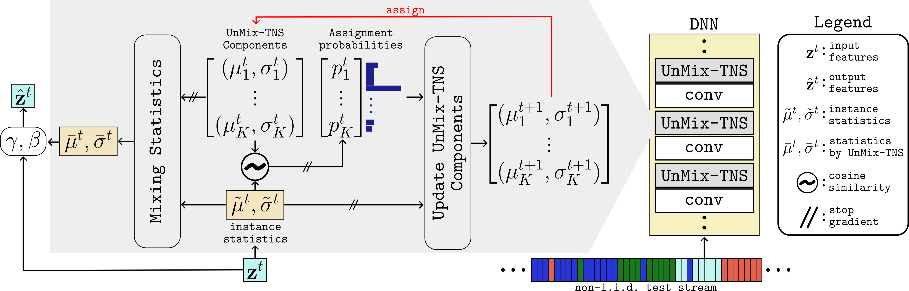

# [ICLR 2024] UnMix-TNS
<!-- Paper Link, Project Link -->
<a href="https://openreview.net/forum?id=xyxU99Nutg"></a>
<a href="https://behzadbozorgtabar.com/UnMix-TNS.html"></a>

This repository contains the official Pytorch implementation of ICLR 2024 paper: "Un-Mixing Test-Time Normalization Statistics:
Combatting Label Temporal Correlation".

## Abstract
Recent test-time adaptation methods heavily rely on nuanced adjustments of batch normalization (BN) parameters. However, one critical assumption often goes overlooked: that of independently and identically distributed (i. i. d. ) test batches with respect to unknown labels. This oversight leads to skewed BN statistics and undermines the reliability of the model under non-i. i. d. scenarios. To tackle this challenge, this paper presents a novel method termed ‘Un-Mixing Test-Time Normalization Statistics’ (UnMix-TNS). Our method re-calibrates the statistics for each instance within a test batch by mixing it with multiple distinct statistics components, thus inherently simulating the i. i. d. scenario. The core of this method hinges on a distinctive online unmixing procedure that continuously updates these statistics components by incorporating the most similar instances from new test batches. Remarkably generic in its design, UnMix-TNS seamlessly integrates with a wide range of leading test-time adaptation methods and pre-trained architectures equipped with BN layers. Empirical evaluations corroborate the robustness of UnMix-TNS under varied scenarios—ranging from single to continual and mixed domain shifts, particularly excelling with temporally correlated test data and corrupted non-i. i. d. real-world streams. This adaptability is maintained even with very small batch sizes or single instances. Our results highlight UnMix-TNS’s capacity to markedly enhance stability and performance across various benchmarks.

## Overview

|  | |||
|:--:|:--:|:--:|:--:|
|(a)|(b)|(c)| |

<b>Test-Time BN (TBN) vs. UnMix-TNS.</b> (a) TBN recalibrates its intermediate features when test batches are i.i.d. sampled over time t, accommodating distribution shifts. (b) However, TBN fails for non-i.i.d. label-based test batch sampling, leading to skewed batch statistics. (c) UnMix-TNS overcomes this failure by estimating unbiased batch statistics through its K statistics components.

<br>
<br>
<br>

|  |
|:--:|
<b>An Overview of UnMix-TNS.</b> Given a batch of non-i.i.d test features $\mathbf{z^t}\in \mathbb{R}^{B\times C \times L}$ at a temporal instance $t$, we mix the instance-wise statistics $(\tilde{\mu}^t, \tilde{\sigma}^t) \in \mathbb{R}^{B \times C}$ with $K$ UnMix-TNS components. The alignment of each sample in the batch with the UnMix-TNS components is quantified through similarity-derived assignment probabilities $p_k^t$. This aids both the <i>mixing</i> process and subsequent component updates for time $t+1$.


## Prerequisites
To use the repository please use the following conda environment

```
conda update conda
conda env create -f environment.yml
conda activate tta 
```

## Training
For testing UnMix-TNS, please run `run.sh` under `tta_experiments`, and modify the appropriate parameters to run other baseline TTA methods with UnMix-TNS layers.

## Thanks
Our code is derived from https://github.com/mariodoebler/test-time-adaptation. Please follow this repository to download datasets under `data` for CIFAR10-C, CIFAR100-C, ImageNet-C, and DomainNet-126.

## Cite
```
@inproceedings{
tomar2024unmixing,
title={Un-Mixing Test-Time Normalization Statistics: Combatting Label Temporal Correlation},
author={Devavrat Tomar and Guillaume Vray and Jean-Philippe Thiran and Behzad Bozorgtabar},
booktitle={The Twelfth International Conference on Learning Representations},
year={2024},
url={https://openreview.net/forum?id=xyxU99Nutg}
}
```